# Below is an expanded, very granular Bible-only mermaid timeline map that includes all those major event-blocks and shows where Daniel 9, Matthew 24, 2 Thess 2, 1 John, and Revelation fit together.

Note: The Bible sometimes gives sequence (especially in Revelation) and sometimes gives markers without exact placement (e.g., some Daniel details). Where exact ordering isn’t explicitly stated, I label it as “marker” rather than pretending precision the text doesn’t give.

```mermaid
flowchart TD

%% =========================================================
%% 0) PRESENT AGE / BASE CONDITIONS
%% =========================================================
A0["Present age: sin entered; death reigns (Rom 5:12; Rom 5:14)"] --> A1["Gospel preached; repentance + faith commanded (Mark 1:15; Acts 17:30)"]
A1 --> A2["Believers suffer tribulation in the world (John 16:33; Acts 14:22)"]
A1 --> A3["Some die: 'with Christ' (Phil 1:23); conscious memory shown (Luke 16:25)"]

%% =========================================================
%% 1) END-OF-AGE TEACHING OF JESUS (MATTHEW 24 / MARK 13 / LUKE 21)
%% =========================================================
A2 --> J0["Beginning of sorrows: wars, rumors, famines, pestilences, earthquakes (Matt 24:6-8)"]
J0 --> J1["Persecution + hatred; many offended; false prophets; love waxes cold (Matt 24:9-12)"]
J1 --> J2["Gospel preached in all the world; then the end comes (Matt 24:14)"]
J2 --> J3["Abomination of desolation spoken of by Daniel (Matt 24:15; Dan 9:27; Dan 11:31; Dan 12:11)"]
J3 --> J4["Great tribulation; flight urgency (Matt 24:16-22)"]
J4 --> J5["False christs/false prophets show signs; deception warning (Matt 24:23-26)"]
J5 --> J6["Cosmic signs: sun darkened etc. (Matt 24:29)"]
J6 --> J7["Son of man appears; angels gather elect (Matt 24:30-31)"]

%% =========================================================
%% 2) ANTICHRIST / MAN OF SIN / BEAST SYSTEM (TEXT AS WRITTEN)
%% =========================================================
A2 --> AC0["Many antichrists already; antichrist denies Father/Son (1 John 2:18; 1 John 2:22)"]
AC0 --> AC1["Spirit of antichrist already in the world (1 John 4:3)"]

A2 --> MS0["Man of sin revealed: opposes/exalts himself; sits in temple of God; claims God (2 Thess 2:3-4)"]
MS0 --> MS1["Lying signs/wonders; deception; strong delusion on those who love not truth (2 Thess 2:9-12)"]
MS1 --> MS2["The Lord consumes him with spirit of His mouth; destroys with brightness of His coming (2 Thess 2:8)"]

%% =========================================================
%% 3) DANIEL'S SEVENTY WEEKS (DAN 9:24-27) - MARKERS
%% =========================================================
A0 --> D70["Seventy weeks determined: finish transgression, end sins, make reconciliation, bring everlasting righteousness, seal vision, anoint most Holy (Dan 9:24)"]
D70 --> D71["From command to restore/build Jerusalem to Messiah the Prince: 7 weeks + 62 weeks (Dan 9:25)"]
D71 --> D72["After 62 weeks: Messiah cut off (Dan 9:26)"]
D72 --> D73["People of the prince that shall come destroy city/sanctuary; war/desolations (Dan 9:26)"]
D73 --> D74["One week: covenant confirmed; in midst of week sacrifice/oblation cease; abomination causes desolate until consummation (Dan 9:27)"]

%% Link Daniel abomination marker to Jesus abomination marker
D74 --> J3

%% =========================================================
%% 4) REVELATION'S BIG ARC: SEALS -> TRUMPETS -> BOWLS
%% =========================================================
A2 --> R0["Throne vision; Lamb worthy to open seals (Rev 4; Rev 5)"]

R0 --> S0["SEALS opened (Rev 6)"]
S0 --> S1["1st seal: white horse (Rev 6:1-2)"]
S0 --> S2["2nd seal: red horse (Rev 6:3-4)"]
S0 --> S3["3rd seal: black horse (Rev 6:5-6)"]
S0 --> S4["4th seal: pale horse; death + hell; sword/hunger/death/beasts (Rev 6:7-8)"]
S0 --> S5["5th seal: martyrs cry 'How long?' (Rev 6:9-11)"]
S0 --> S6["6th seal: great earthquake; cosmic disturbance; wrath fear (Rev 6:12-17)"]

S6 --> I0["Interlude: sealing 144,000; great multitude before throne (Rev 7)"]

I0 --> S7["7th seal: silence; introduces trumpets (Rev 8:1-2)"]

S7 --> T0["TRUMPETS (Rev 8-11)"]
T0 --> T1["1st trumpet: hail/fire; 1/3 earth/trees burned (Rev 8:7)"]
T0 --> T2["2nd trumpet: burning mountain; 1/3 sea becomes blood (Rev 8:8-9)"]
T0 --> T3["3rd trumpet: Wormwood; 1/3 waters bitter (Rev 8:10-11)"]
T0 --> T4["4th trumpet: 1/3 sun/moon/stars darkened (Rev 8:12)"]
T0 --> T5["5th trumpet (woe): locust torment (Rev 9:1-11)"]
T0 --> T6["6th trumpet (woe): great army; 1/3 mankind killed (Rev 9:13-21)"]

T6 --> W0["Witnesses: prophesy; beast kills them; resurrection/ascension; earthquake (Rev 11:3-13)"]
W0 --> T7["7th trumpet: kingdom proclaimed; time to judge dead/reward servants (Rev 11:15-18)"]

%% =========================================================
%% 5) BEAST / FALSE PROPHET / MARK / GREAT HARLOT / BABYLON
%% =========================================================
T7 --> B0["Woman/child/dragon conflict (Rev 12)"]
B0 --> B1["Beast from sea: blasphemy; war with saints; authority (Rev 13:1-10)"]
B1 --> B2["Beast from earth / false prophet role: signs; image; mark enforced (Rev 13:11-18)"]

B2 --> H0["Harlot/Babylon described; beast/ten horns; kings/merchants (Rev 17-18)"]
H0 --> H1["Babylon judged/falls; lament; heaven rejoices (Rev 18; Rev 19:1-5)"]

%% =========================================================
%% 6) RETURN OF CHRIST + WAR + INITIAL FINAL JUDGMENTS (REV 19-20)
%% =========================================================
H1 --> C0["Christ appears as King of kings; armies follow (Rev 19:11-16)"]
C0 --> C1["Beast + kings gathered to make war (Rev 19:19)"]
C1 --> C2["Beast seized; false prophet seized; both cast alive into lake of fire (Rev 19:20)"]
C2 --> C3["Rest slain; birds filled (Rev 19:21)"]

C3 --> SA0["Satan bound 1,000 years; shut up; no deceive nations until finished (Rev 20:1-3)"]
SA0 --> K0["Thrones: judgment given; beheaded for witness; lived/reigned 1,000 years (Rev 20:4)"]
K0 --> K1["First resurrection: blessed/holy; second death no power (Rev 20:5-6)"]

%% =========================================================
%% 7) END OF 1,000 YEARS -> FINAL REBELLION -> SATAN'S FINAL DOOM
%% =========================================================
K1 --> L0["After 1,000 years: Satan loosed (Rev 20:7)"]
L0 --> L1["Deceives nations; Gog/Magog; gather to battle (Rev 20:8)"]
L1 --> L2["Surround camp of saints; fire from God devours them (Rev 20:9)"]
L2 --> L3["Devil cast into lake of fire (Rev 20:10)"]

%% =========================================================
%% 8) GREAT WHITE THRONE JUDGMENT + DEATH DESTROYED (LAST ENEMY)
%% =========================================================
L3 --> G0["Great white throne; earth/heaven flee (Rev 20:11)"]
G0 --> G1["Dead stand; books opened; judged by works (Rev 20:12)"]
G1 --> G2["Sea gives dead; death/Hades deliver dead; judged (Rev 20:13)"]
G2 --> G3["Death and Hades cast into lake of fire (Rev 20:14)"]
G3 --> G4["Not in book of life -> lake of fire (Rev 20:15)"]
G3 --> G5["Death destroyed as last enemy (Rev 20:14; 1 Cor 15:26)"]

%% =========================================================
%% 9) FINAL STATE: NEW HEAVEN/NEW EARTH + NEW JERUSALEM (NO DEATH)
%% =========================================================
G5 --> N0["New heaven + new earth (Rev 21:1; Isa 66:22)"]
N0 --> N1["New Jerusalem descends (Rev 21:2)"]
N1 --> N2["God dwells with men; they are His people (Rev 21:3)"]
N2 --> N3["No more death; no sorrow/crying/pain (Rev 21:4)"]
N3 --> N4["Former things passed away (Rev 21:4)"]
N4 --> N5["No more curse (Rev 22:3)"]
N5 --> N6["See His face; His name on foreheads (Rev 22:4)"]
N6 --> N7["No night; Lord gives light; reign forever (Rev 22:5)"]

%% =========================================================
%% 10) ISAIAH 65 "NEW HEAVENS/NEW EARTH" DETAILS (DEATH PRESENT)
%% =========================================================
N0 --> IS0["Isaiah 65:17-25 description (Isa 65:17-25)"]
IS0 --> IS1["Former not remembered (Isa 65:17)"]
IS0 --> IS2["Jerusalem rejoicing; no weeping/crying heard (Isa 65:18-19)"]
IS0 --> IS3["Yet: child dies at 100; sinner accursed (Isa 65:20)"]
IS0 --> IS4["Build/inhabit; plant/eat; long life (Isa 65:21-23)"]
IS0 --> IS5["Before call, God answers (Isa 65:24)"]
IS0 --> IS6["No hurt/destroy in holy mountain; wolf/lamb (Isa 65:25)"]

%% =========================================================
%% 11) IDENTITY / MEMORY / RECOGNITION ANCHORS (BIBLE-ONLY)
%% =========================================================
N2 --> M0["Memory/identity shown beyond death: 'remember' (Luke 16:25); martyrs remember injustice (Rev 6:10)"]
M0 --> M1["Knowledge increases: 'then shall I know' (1 Cor 13:12)"]
M1 --> M2["Recognition after resurrection shown: 'it is I myself' (Luke 24:39); Moses/Elijah recognized (Matt 17:3)"]
```

