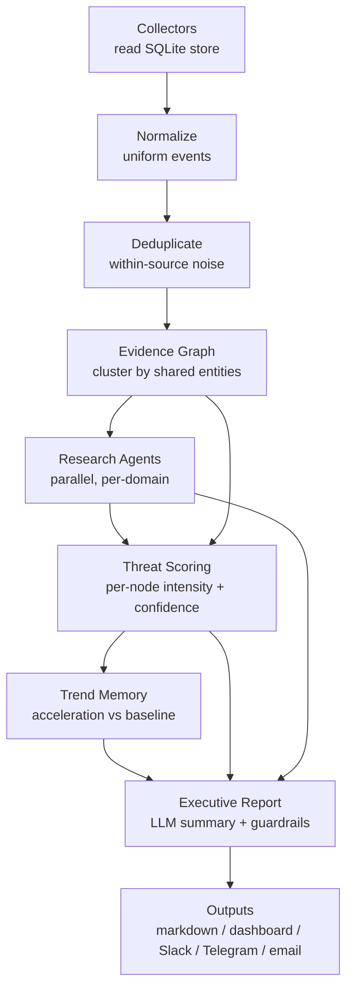

# Early-Warning Pipeline Architecture

This document explains the `earlywarning/` package — a multi-agent,
evidence-driven refactor of BibleStudy's collection→analysis flow — and the
reasoning (the "MiroFish" architecture analysis) that motivated it.

---

## 1. Why this refactor

The original flow ran each `fetch_*.py` script as a subprocess, scraped its
**stdout markdown** with regexes, and concatenated the text into a weekly
review. That works, but it is fragile (output-format changes silently break
parsing), single-threaded, and it reasons over isolated headlines rather than
corroborated situations.

A review of the "MiroFish" multi-agent system concluded it is **not** suitable
as a turnkey engine for this project, but that several of its *orchestration
patterns* are high-value and worth adopting:

| Pattern stolen | How it appears here |
|----------------|---------------------|
| Multi-agent research (coordinator → specialists) | `research.ResearchCoordinator` fans out one specialist per domain (war, financial, disaster, cosmic, digital-control, …) |
| Evidence-first (sources → dedupe → cluster → facts → confidence) | `normalize` → `dedupe` → `evidence_graph` → `scoring` |
| Cross-validation (require multiple independent sources) | confidence is capped unless ≥2–3 distinct sources corroborate (`scoring`, `research`) |
| Parallel research | agents run concurrently via a thread pool |
| Research memory / acceleration | `trends` compares the current window to a trailing baseline |
| Evidence graph | events are linked by shared entities/keywords into clusters |
| Confidence scoring + final reasoning model | `scoring` + the executive `report` |

What we deliberately did **not** adopt: MiroFish's social-simulation core, its
hosted graph dependency, and its 10–20 minute latency model — none of which fit
a watch/early-warning workflow.

---

## 2. Pipeline stages



| Stage | Module | Responsibility |
|-------|--------|----------------|
| Collect | `collectors/` | Read the SQLite tables the `fetch_*.py` scripts populate → `RawSignal`s |
| Normalize | `normalize.py` | Uniform `NormalizedEvent`s: stable ids, parsed dates, domain, entities |
| Dedupe | `dedupe.py` | Collapse near-duplicate reports *within a source* (keeps cross-source signal) |
| Evidence graph | `evidence_graph.py` | Union-find clustering by shared entities/keywords → `EvidenceCluster`s |
| Research | `research.py` | Coordinator fans specialist agents across domains in parallel |
| Scoring | `scoring.py` | Per prophecy-node intensity (0–100) + cross-validated confidence + overall phase |
| Trends | `trends.py` | Recent activity vs trailing baseline (escalating / steady / easing) |
| Report | `report.py` | Executive summary (LLM or deterministic) + guardrail footer |
| Outputs | `outputs/` | Local artefacts always; Slack/Telegram/email opt-in |

### Separation of ingestion and analysis

The network-facing `fetch_*.py` scripts remain the **ingestion layer** that
populates `data/prophecy_tracking.db`. The pipeline **reads** that store, so all
analysis is deterministic, offline, and unit-testable. Refresh data first:

```bash
python scripts/ingest_data.py --days 7
python scripts/run_pipeline.py --days 7
```

---

## 3. Provider-agnostic LLM

The pipeline never imports a vendor SDK directly. It talks to
`earlywarning.llm.LLMClient`, which selects a backend at runtime:

* **anthropic** — when `ANTHROPIC_API_KEY` is set (model via `ANTHROPIC_MODEL`).
* **openai** — when `OPENAI_API_KEY` is set (model via `OPENAI_MODEL`).
* **heuristic** — deterministic offline fallback used when no key is present.

`LLM_PROVIDER` (`auto`|`anthropic`|`openai`|`none`) forces the choice; `auto`
prefers Anthropic, then OpenAI, then heuristic. SDK imports are lazy, so neither
package needs to be installed unless its backend is actually used.

Every LLM call has a **deterministic fallback**: specialist agents compute a
structured finding from the cluster data first, then ask the model to sharpen
it; `complete_json` backfills any keys the model omits. The whole pipeline
therefore produces a complete, sensible report with **no keys and no network**.

---

## 4. Guardrails (unchanged project policy)

These are encoded in code, not just prose:

1. **No date-setting** (Matt 24:36) — scoring measures *pattern*, never timing.
2. **Pattern ≠ fulfilment** — high intensity means *resembles* the scriptural
   description, never "fulfilled".
3. **Cross-verify before High confidence** — a node backed by a single source
   cannot reach High confidence regardless of severity.
4. **Watchfulness, not fear** (Luke 21:28).

The guardrail block is appended to every report by `report.GUARDRAILS`.

---

## 5. Extending the pipeline

* **New data source:** add a `Collector` subclass in
  `collectors/db_collectors.py` (or a new module) and register it in
  `collectors/registry.ALL_DB_COLLECTORS`. Map it to a domain in
  `taxonomy.DOMAINS`.
* **New research domain:** add a `Domain` to `taxonomy.DOMAINS`; the coordinator
  picks it up automatically once a collector feeds it.
* **New prophecy node:** add a `Node` to `taxonomy.NODES` with its scripture and
  weight.
* **New delivery channel:** add a sender in `outputs/dispatcher.py`.

Run the tests after any change:

```bash
python -m pytest
```

---

## 6. Status / honest limitations

* Collectors currently cover the tables that are actually populated today
  (earthquakes, conflicts, disasters, economic indicators, World Bank news).
  Space-weather, EFF, Temple-Mount, and antichrist-pattern sources do not yet
  persist to the DB; their domains will activate automatically once those
  `fetch_*.py` scripts write rows (add the matching collector + table).
* The heuristic backend produces structured, honest summaries but no genuine
  narrative reasoning — wire a real LLM key for that.
* This is research/watch tooling. It is intentionally conservative about
  confidence and never asserts prophetic timing.
