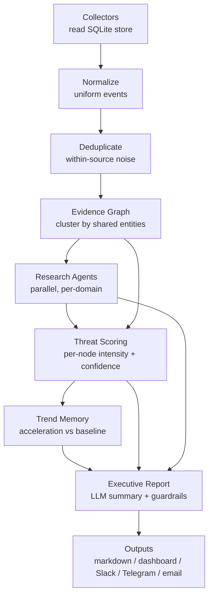
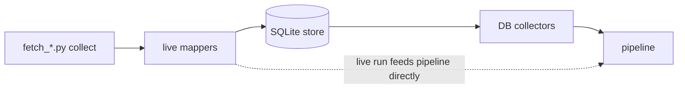

# Early-Warning Pipeline Architecture

This document explains the `earlywarning/` package — a multi-agent,
evidence-driven refactor of BibleStudy's collection→analysis flow — and the
reasoning (the "MiroFish" architecture analysis) that motivated it.

---

## 1. Why this refactor

The original flow ran each `fetch_*.py` script as a subprocess, scraped its
**stdout markdown** with regexes, and concatenated the text into a weekly
review. That works, but it is fragile (output-format changes silently break
parsing), single-threaded, and it reasons over isolated headlines rather than
corroborated situations.

A review of the "MiroFish" multi-agent system concluded it is **not** suitable
as a turnkey engine for this project, but that several of its *orchestration
patterns* are high-value and worth adopting:

| Pattern stolen | How it appears here |
|----------------|---------------------|
| Multi-agent research (coordinator → specialists) | `research.ResearchCoordinator` fans out one specialist per domain (war, financial, disaster, cosmic, digital-control, …) |
| Evidence-first (sources → dedupe → cluster → facts → confidence) | `normalize` → `dedupe` → `evidence_graph` → `scoring` |
| Cross-validation (require multiple independent sources) | confidence is capped unless ≥2–3 distinct sources corroborate (`scoring`, `research`) |
| Parallel research | agents run concurrently via a thread pool |
| Research memory / acceleration | `trends` compares the current window to a trailing baseline |
| Evidence graph | events are linked by shared entities/keywords into clusters |
| Confidence scoring + final reasoning model | `scoring` + the executive `report` |

What we deliberately did **not** adopt: MiroFish's social-simulation core, its
hosted graph dependency, and its 10–20 minute latency model — none of which fit
a watch/early-warning workflow.

---

## 2. Pipeline stages



| Stage | Module | Responsibility |
|-------|--------|----------------|
| Collect | `collectors/` | Read the SQLite tables the `fetch_*.py` scripts populate → `RawSignal`s |
| Normalize | `normalize.py` | Uniform `NormalizedEvent`s: stable ids, parsed dates, domain, entities |
| Dedupe | `dedupe.py` | Collapse near-duplicate reports *within a source* (keeps cross-source signal) |
| Evidence graph | `evidence_graph.py` | Union-find clustering by shared entities/keywords → `EvidenceCluster`s |
| Research | `research.py` | Coordinator fans specialist agents across domains in parallel |
| Scoring | `scoring.py` | Per prophecy-node intensity (0–100) + cross-validated confidence + overall phase |
| Trends | `trends.py` | Recent activity vs trailing baseline (escalating / steady / easing) |
| Report | `report.py` | Executive summary (LLM or deterministic) + guardrail footer |
| Change detection | `changes.py` / `state.py` | Diff vs the previous run; alert level + threshold crossings; run history in `pipeline_runs` |
| Source health | `freshness.py` | Flags stale source tables (silent-failure detection) |
| Dashboard | `dashboard.py` | Self-contained HTML UI (alert banner, gauge, node bars, finding cards, sparklines) |
| Outputs | `outputs/` | Local artefacts always (markdown, JSON, HTML); Slack/Telegram/email level-gated, change-gated, debounced |

### Early-warning alerting (warn on change, not on snapshot)

Each run is stored in `pipeline_runs`. The next run diffs against it
(`changes.py`) to produce an **alert level** (GREEN/WATCH/AMBER/RED) and a list
of specific changes — node band crossings, phase shifts, overall deltas, new
escalations. Outward channels are then:

* **Level-gated:** each channel has a minimum level (`SLACK_MIN_LEVEL`,
  `TELEGRAM_MIN_LEVEL`, `EMAIL_MIN_LEVEL`).
* **Change-gated:** with `ALERT_NOTIFY_ONLY_ON_CHANGE=true`, a channel fires
  only when the level rose, it is the first run, or a fresh change at/above its
  severity occurred.
* **Debounced:** repeat notifications at the same level inside
  `ALERT_COOLDOWN_HOURS` are suppressed (unless the level rose).

`freshness.py` flags any source table that has gone stale beyond its expected
cadence — a stale Tier-1 source (earthquakes, economic) is itself a warning.

### Separation of ingestion and analysis

The network-facing `fetch_*.py` scripts are the **ingestion layer** that
populates `data/prophecy_tracking.db`. The pipeline **reads** that store, so all
analysis is deterministic, offline, and unit-testable. Refresh data first:

```bash
python scripts/ingest_data.py --days 7      # fetch every source, persist to DB
python scripts/run_pipeline.py --days 7     # offline replay + analysis
```

### Hybrid live mode

Each `fetch_*.py` is split into a pure `parse()` (fixture-tested, offline) and a
network `fetch()`/`collect()`. Two ways the pipeline gets data:

* **Offline (default):** `collect_all()` reads the SQLite tables. Deterministic.
* **Live (`--live`):** `collect_live()` runs every `fetch_*.py` `collect()` over
  the network, maps results to `RawSignal`s, **persists them** to the DB
  (`earlywarning/persist.py`), then analyses the fresh data. Every later offline
  run replays what was persisted.

```bash
python scripts/run_pipeline.py --days 7 --live   # fetch + persist + analyse
```

`ingest_data.py` uses the same live-collect + persist path, so it now ingests
**all** sources (earthquakes, disasters, conflicts, economic indicators, World
Bank, space weather, EFF/digital-rights, Temple-Mount, FRED news) — not just
earthquakes as before.



---

## 3. Provider-agnostic LLM

The pipeline never imports a vendor SDK directly. It talks to
`earlywarning.llm.LLMClient`, which selects a backend at runtime:

* **anthropic** — when `ANTHROPIC_API_KEY` is set (model via `ANTHROPIC_MODEL`).
* **openai** — when `OPENAI_API_KEY` is set (model via `OPENAI_MODEL`).
* **heuristic** — deterministic offline fallback used when no key is present.

`LLM_PROVIDER` (`auto`|`anthropic`|`openai`|`none`) forces the choice; `auto`
prefers Anthropic, then OpenAI, then heuristic. SDK imports are lazy, so neither
package needs to be installed unless its backend is actually used.

Every LLM call has a **deterministic fallback**: specialist agents compute a
structured finding from the cluster data first, then ask the model to sharpen
it; `complete_json` backfills any keys the model omits. The whole pipeline
therefore produces a complete, sensible report with **no keys and no network**.

---

## 4. Guardrails (unchanged project policy)

These are encoded in code, not just prose:

1. **No date-setting** (Matt 24:36) — scoring measures *pattern*, never timing.
2. **Pattern ≠ fulfilment** — high intensity means *resembles* the scriptural
   description, never "fulfilled".
3. **Cross-verify before High confidence** — a node backed by a single source
   cannot reach High confidence regardless of severity.
4. **Watchfulness, not fear** (Luke 21:28).

The guardrail block is appended to every report by `report.GUARDRAILS`.

---

## 4b. The specific-trigger layer

The original nine sources are mostly **J0 "birth pains" sensors** — diffuse
background indicators (earthquakes, conflicts, economic stress). The trigger
layer adds sensors for the *discrete named events* the prophetic texts
anchor on. Birth pains indicate the phase; triggers indicate a transition.

| Source | Table | Node | Scripture | What fires it |
|---|---|---|---|---|
| `covenant` | `covenant_watch` | D1 | Dan 9:27 | Israel-involving treaties, normalization deals, security guarantees |
| `temple_mount` (extended) | `temple_mount_news` | J3 | Dan 9:27; Matt 24:15 | Temple-preparation markers: red heifer, priesthood, altar, vessels |
| `cbdc` | `cbdc_tracker` | B2 | Rev 13:16-17 | CBDC/digital-ID rollouts, with status staging (research → pilot → launched → mandatory) |
| `coalition` | `coalition_events` | E38 | Ezek 38:1-6 | ≥2 of the named nations (Russia/Iran/Turkey/Sudan/Libya) acting together militarily |
| `eu` | `eu_consolidation` | D2 | Dan 2:40-43; 7:23-24 | EU centralization: treaty change, defense/fiscal union, veto abolition |
| `ai_enforcement` | `ai_enforcement` | B4/MS1 | Rev 13:15 | AI coupled to *compulsion*: algorithmic enforcement, surveillance mandates, incidents, veneration |
| `gospel` | `gospel_reach` | M14 | Matt 24:14 | Bible-translation statistics (the one positive precondition) |
| `who_outbreaks` | `disease_outbreaks` | J0 | Luke 21:11 | WHO Disease Outbreak News — completes the wars/famines/pestilences/earthquakes quartet |

Design rules for this layer:

* **Framework-agnostic sensors first.** Covenant, temple, and commerce-control
  fire under *every* major Antichrist framework (European, Middle-Eastern, or
  hybrid). The coalition and EU trackers are *discriminators* — their relative
  activity indicates which geographic reading is tracking toward reality.
  The pipeline observes; it does not pick a theory (2 Thess 2:3 — the man is
  *revealed*, not deduced in advance).
* **Compulsion, not capability.** The AI tracker deliberately ignores model
  releases and vendor claims. Rev 13:15's shape is an image that speaks *and
  causes* — so only AI-coupled-to-enforcement events count.
* **Infrastructure is not identification.** A CBDC is capacity, not "the
  mark"; a treaty is diplomacy until it isn't. Confidence staging encodes
  this (mandatory/compulsion events score High; research/reports score Low).
* **New nodes start at zero.** D1/D2/E38/B4/M14 contribute nothing to the
  overall score until their collectors actually produce corroborated data.

## 5. Extending the pipeline

* **New data source:** add a `Collector` subclass in
  `collectors/db_collectors.py` (or a new module) and register it in
  `collectors/registry.ALL_DB_COLLECTORS`. Map it to a domain in
  `taxonomy.DOMAINS`.
* **New research domain:** add a `Domain` to `taxonomy.DOMAINS`; the coordinator
  picks it up automatically once a collector feeds it.
* **New prophecy node:** add a `Node` to `taxonomy.NODES` with its scripture and
  weight.
* **New delivery channel:** add a sender in `outputs/dispatcher.py`.

Run the tests after any change:

```bash
python -m pytest
```

---

## 6. Status / honest limitations

* **All sixteen sources now persist and activate** their domains (war,
  disaster, famine, financial, cosmic, digital-control, middle-east, covenant,
  coalition, eu-power, ai-enforcement, gospel, health). Run with `--live`
  (or `ingest_data.py`) once to populate, then offline runs replay them. The
  `antichrist_patterns` monitor remains a framework with no live feed and is
  intentionally not wired to a collector.
* The trigger-layer news sources (covenant, coalition, CBDC, EU, AI) rely on
  keyword classifiers over RSS feeds — precision over recall. They will miss
  paraphrased events and are meant to surface candidates for human review,
  not to be exhaustive.
* `gospel_reach` tries a JSON endpoint (override with `GOSPEL_STATS_URL`),
  then falls back to parsing the Wycliffe statistics pages (annual HTML).
  If nothing is reachable it degrades to empty and is flagged by freshness
  (400-day allowance for its annual cadence).
* `who_outbreaks` uses Google News aggregation as its primary path because
  who.int serves 403 to non-browser clients; the direct WHO feeds are kept
  as best-effort extras.
* Live collection depends on the external feeds being reachable and on the
  relevant API keys (`FRED_API_KEY`, `EINNEWS_RSS_KEY`); a source that errors or
  is unkeyed simply contributes nothing that cycle (it never breaks the run).
* The heuristic backend produces structured, honest summaries but no genuine
  narrative reasoning — wire a real LLM key for that.
* This is research/watch tooling. It is intentionally conservative about
  confidence and never asserts prophetic timing.
